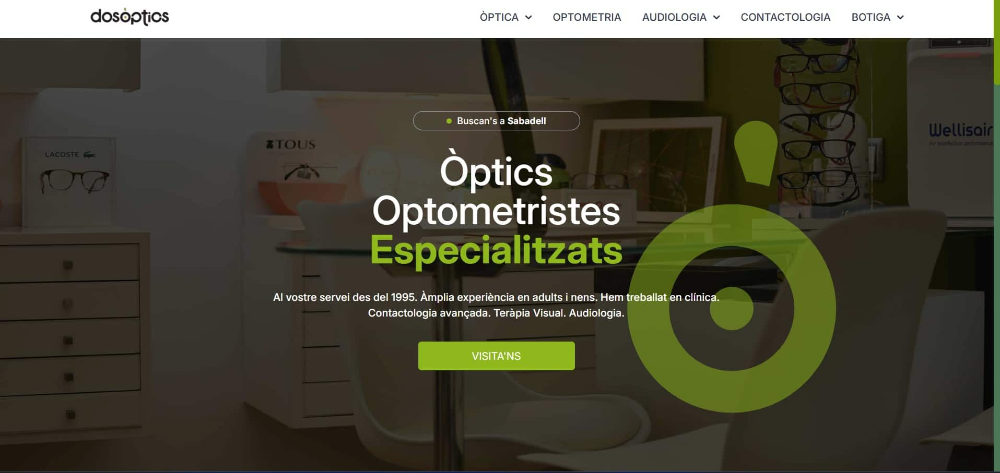
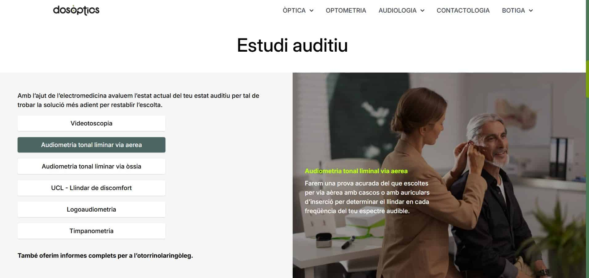

# Dos Òptics Website

I made this website with love for my trusted optical store.
The main goal of the site is to showcase their services and product areas, while also providing clear information about the physical location of the store.

This is a static webpage. That means the whole content is placed locally and does not run on the server, and also has no database because it has not been necessary yet.

## 🛠️ Technologies used

- [Astro](https://astro.build/) as the main framework. It is perfect for static websites and has some useful functionalities like creating reusable components or layouts. Astro is also good for creating fast websites and easy to deploy.
- HTML and Tailwind CSS for styling and responsive design.
- Javascript for creating simple client functions